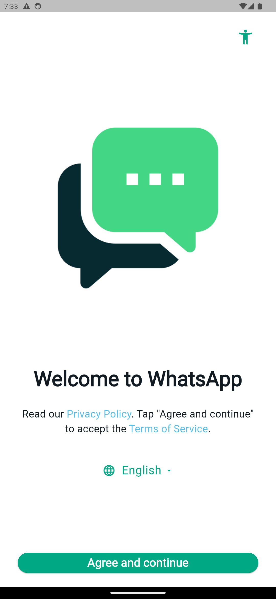
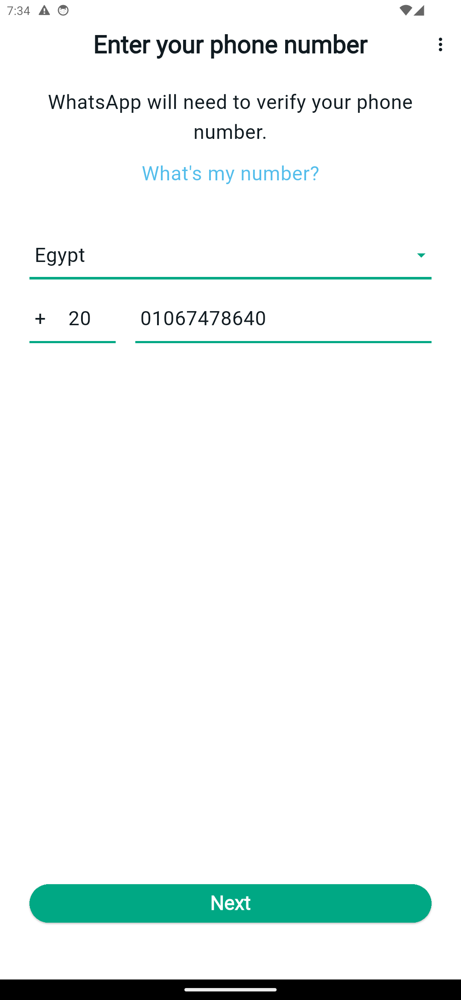
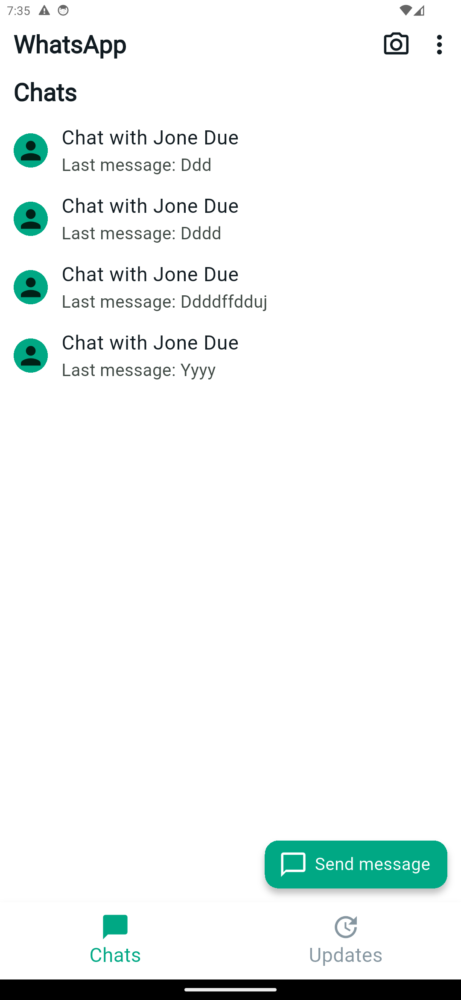
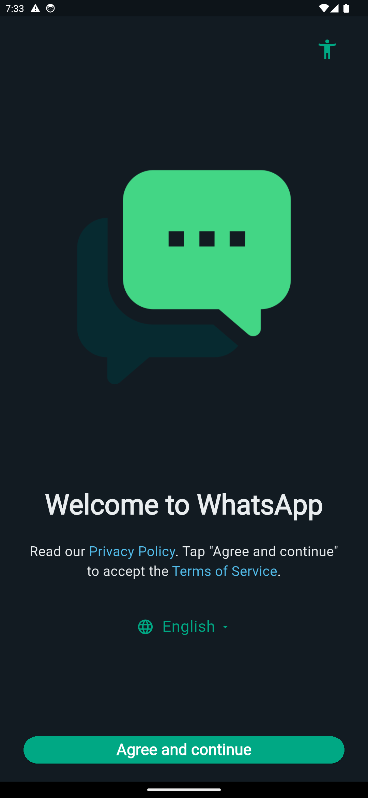
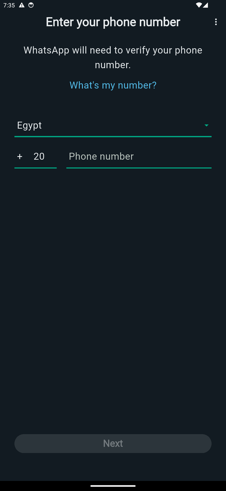
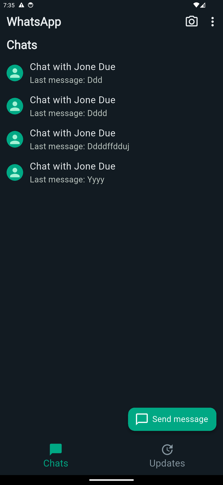
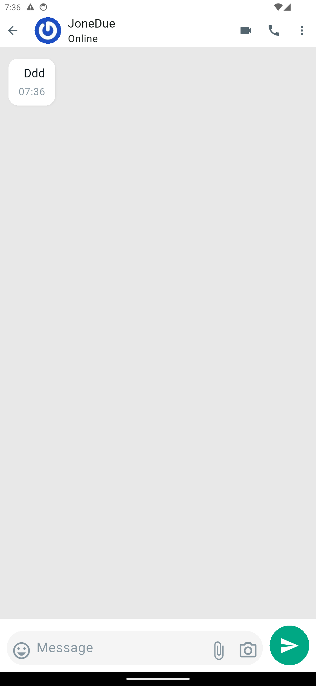
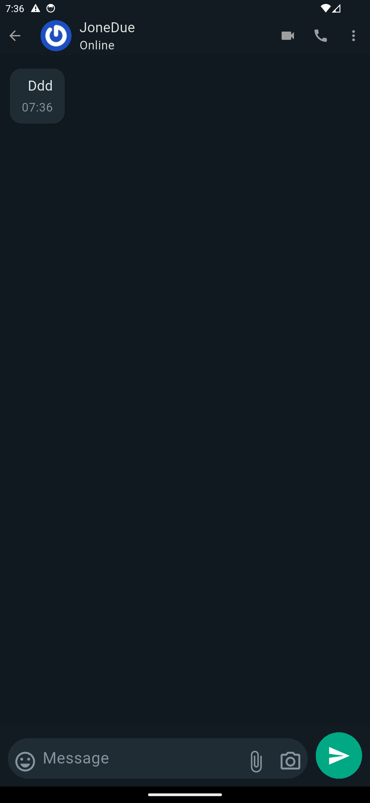

# **WhatsApp Clone \- Flutter Showcase Application**

This project is a high-fidelity WhatsApp clone built with Flutter as part of a technical assessment. It aims to demonstrate a robust and scalable application architecture, a clean UI/UX design, and core real-time messaging functionalities.

## **🚀 Key Features**

* **Authentication:** Full user welcome and login flow (currently simulating phone number auth with Firebase Auth).
* **Real-time Chat:** Send and receive instant messages using Cloud Firestore.
* **Contacts List:** Fetch and display a list of registered users from the database.
* **Stories/Status View:** A simulation of the "Stories" interface, complete with progress indicators and controls (auto-advance, tap-to-skip).
* **Light & Dark Mode Support:** A complete design that seamlessly supports both themes.
* **Responsive UI:** Utilizes flutter\_screenutil to ensure all UI components are responsive across different screen sizes.

## **📱 Application Screenshots**

The application is designed to be fully functional and aesthetically consistent in both Light and Dark modes.

| Welcome | Login | Chat List |
| :---- | :---- | :---- |
|  |  |  |
|  |  |  |

| Chat Screen - Light Mode | Chat Screen - Dark Mode |
| :---- | :---- |
|  |  |


### Screenshots Setup

Create a `screenshots` folder in your project root and place the screenshot images inside it.

## **🚀 Getting Started**

To run this project locally, follow these steps:

### **1\. Prerequisites**

Ensure you have the [Flutter SDK](https://flutter.dev/docs/get-started/install) installed on your machine.

### **2\. Clone the Repository**

```bash
git clone https://github.com/elsaramji/zt_whatsapp_task.git
cd zt_whatsapp_task
```

### **3\. Install Dependencies**

Run the following command to fetch all the required packages:

flutter pub get

### **4\. Firebase Setup**

This project requires a Firebase setup (as indicated by the existing firebase\_options.dart and google-services.json files).

1. Create a new project on the [Firebase Console](https://console.firebase.google.com/).
2. Add an Android and/or iOS app to your project using the same Package Name/Bundle ID found in this project.
3. Follow the setup instructions and place your google-services.json (for Android) and GoogleService-Info.plist (for iOS) files in the correct directories.
4. Enable **Authentication** (Email/Password) and **Cloud Firestore** in your Firebase project dashboard.

### **5\. Run the Application**

flutter run

## **🏗️ Technical Architecture**

This project follows the principles of **Clean Architecture** to ensure a clear Separation of Concerns (SoC), making the codebase modular, testable, and maintainable.

### **1\. Core Structure: Clean Architecture**

The code is divided into three main layers for each feature (e.g., auth, chats):

* **Presentation:**
  * Contains the UI (Views/Screens) and presentation logic.
  * Uses **Cubit** (flutter\_bloc) for State Management, decoupling business logic from the UI.
* **Domain:**
  * The core of the application. Contains the core business logic, Entities (data models), and abstract Repositories.
  * Employs **Use Cases** to trigger specific business logic, acting as a bridge between the Presentation and Data layers.
* **Data:**
  * Contains the concrete implementation of the Repositories.
  * Communicates with **Data Sources** (like Firebase) to fetch or send data.

### **2\. State Management**

* **Cubit (flutter\_bloc):** Chosen as a lightweight and efficient solution for state management. Cubits provide streams of states to the UI, allowing it to rebuild on data changes while keeping the code clean and readable.

### **3\. Backend & Database**

* **Firebase Authentication:** Manages user sign-up and login operations.
* **Cloud Firestore:** A NoSQL database used for storing all real-time data. The data is structured into collections:
  * users: Stores user data (ID, phone, name, avatar).
  * chats: Stores chat sessions, containing participants and a sub-collection for messages.

### **4\. UI & UX**

* **flutter\_screenutil:** Ensures the UI is responsive and adapts correctly to various screen sizes and pixel densities.
* **google\_fonts:** Used to simulate the WhatsApp font family for a consistent visual identity.
* **Theming:** Centralized app\_themes.dart and app\_colors.dart files provide a unified color system and full support for switching between Light and Dark modes.

### **5\. Navigation**

* **go\_router:** Implements a declarative routing system for clean, centralized navigation management.

## **📁 Project Structure**

The code is organized by feature (feature-first) to promote the Clean Architecture structure:

lib/
├── core/                   \# Shared code (Themes, Routes, Colors)
│   ├── routes/
│   └── theme/
│
├── features/               \# Core application features
│   ├── auth/               \# Authentication feature
│   │   ├── data/           \# Data Sources and Repository Impl
│   │   ├── domain/         \# Entities, Use Cases, and Repo Interfaces
│   │   └── presentation/   \# Views (Screens) and Cubits
│   │
│   ├── chats/              \# Chat feature
│   │   ├── data/
│   │   ├── domain/
│   │   └── presentation/
│   │
│   ├── home/               \# Home screen and Contact List
│   │   ├── data/
│   │   ├── domain/
│   │   └── presentation/
│   │
│   └── status/             \# Status (Stories) feature
│       ├── data/
│       ├── domain/
│       └── presentation/
│
├── firebase\_options.dart   \# Firebase configuration
└── main.dart               \# Application entry point
